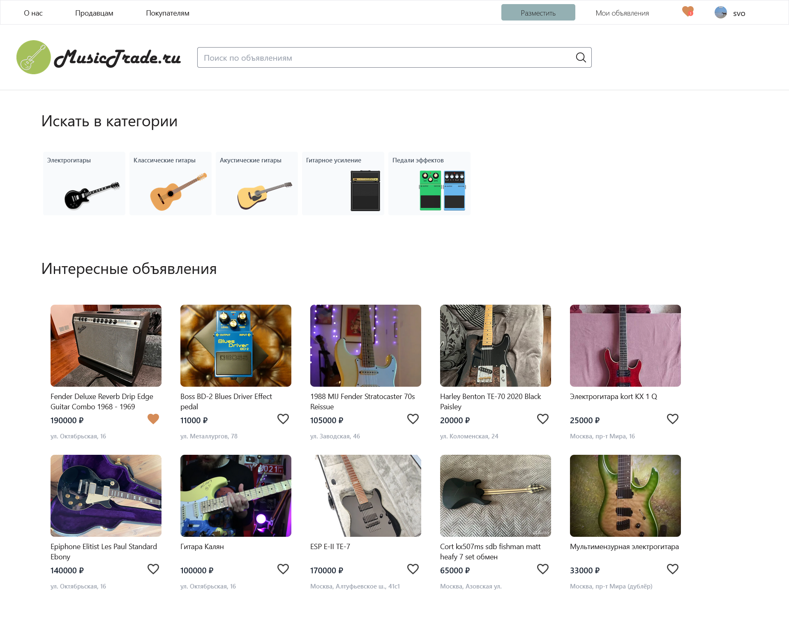
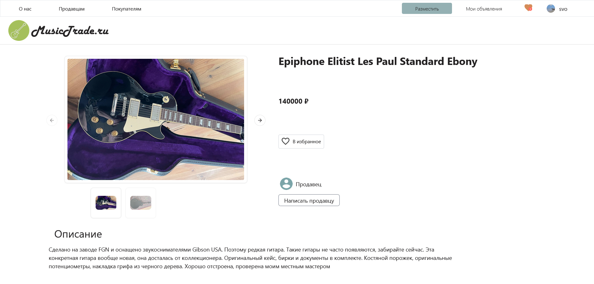
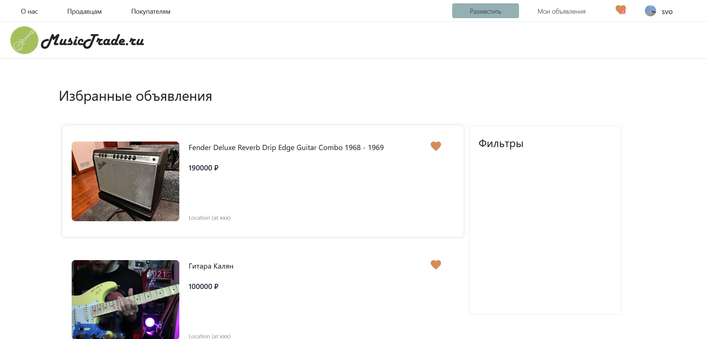

# MusicTrade.ru

Online music gear trading platform. Sell & exchange your gear easily with MusicTrade.

&nbsp;
&nbsp;
&nbsp;
&nbsp;

&nbsp;

&nbsp;
&nbsp;
&nbsp;

## Content

- [Website](#website)
- [Usage](#usage)

## Website
Main page

Listing overview page

Favorites

## Usage

> [!WARNING]
> Project hosting discontinued, backend database dropped. 

